# 日常办公超级智能体系统设计文档

## 1. 概述

### 1.1 项目定位
本系统是一个基于 LangChain 和 LangGraph 框架构建的日常办公超级智能体,使用本地 Ollama 模型作为核心推理引擎。系统旨在通过多智能体协作模式,自动化处理日常办公场景中的复杂任务,包括文档处理、邮件管理、日程安排、数据分析、知识问答、文件系统管理等。

### 1.2 核心价值
- **隐私保护**: 所有数据和模型推理均在本地执行,无需依赖云端服务
- **智能协作**: 通过 LangGraph 实现多智能体之间的状态流转和协作决策
- **可扩展性**: 基于插件化架构,支持快速添加新的办公场景处理能力
- **自主决策**: 智能体具备任务分解、工具选择和执行反思能力

### 1.3 技术栈
- **核心框架**: LangChain (智能体编排)、LangGraph (状态图管理)
- **语言模型**: 本地 Ollama (支持 Llama、Mistral 等开源模型)
- **开发语言**: Python 3.10+
- **向量数据库**: ChromaDB 或 FAISS (知识库存储)
- **文档处理**: LangChain Document Loaders
- **任务调度**: APScheduler

## 2. 系统架构

### 2.1 整体架构

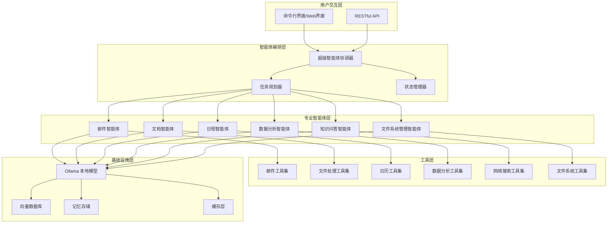

### 2.2 架构层级说明

#### 用户交互层
负责接收用户指令,支持命令行界面和 Web 界面两种交互方式,通过统一的 API 层与智能体编排层通信。

#### 智能体编排层
- **超级智能体协调器**: 作为系统的中枢,接收用户任务并调度专业智能体
- **任务规划器**: 将复杂任务分解为子任务,并确定执行顺序和依赖关系
- **状态管理器**: 基于 LangGraph 管理任务执行过程中的状态流转

#### 专业智能体层
每个专业智能体负责特定领域的任务处理,具备独立的推理和决策能力。

#### 工具层
为专业智能体提供具体的操作能力,每个工具集封装特定领域的原子操作。

#### 基础设施层
提供模型推理、数据存储、记忆管理等底层能力支持。

## 3. LangGraph 状态图设计

### 3.1 主流程状态图

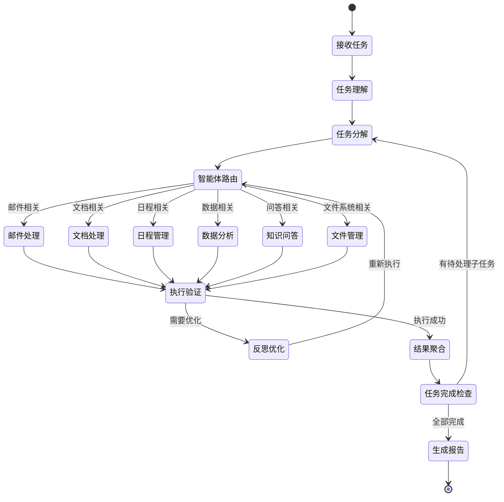

### 3.2 状态节点定义

| 状态节点 | 职责描述 | 输入 | 输出 |
|---------|---------|------|------|
| 接收任务 | 接收用户的自然语言指令 | 用户输入字符串 | 原始任务对象 |
| 任务理解 | 使用 LLM 解析任务意图和实体 | 原始任务对象 | 结构化任务描述 |
| 任务分解 | 将复杂任务拆解为可执行的子任务 | 结构化任务描述 | 子任务列表及依赖图 |
| 智能体路由 | 根据子任务类型选择合适的专业智能体 | 子任务对象 | 目标智能体标识 |
| 邮件/文档/日程/数据/知识/文件处理 | 各专业智能体执行具体任务 | 子任务及上下文 | 执行结果 |
| 执行验证 | 验证执行结果的正确性和完整性 | 执行结果 | 验证状态 (成功/失败/需优化) |
| 反思优化 | 分析失败原因并调整执行策略 | 失败信息及历史记录 | 优化后的执行计划 |
| 结果聚合 | 合并多个子任务的执行结果 | 多个执行结果 | 聚合后的结果 |
| 任务完成检查 | 检查是否所有子任务均已完成 | 任务执行状态 | 完成标志 |
| 生成报告 | 生成用户友好的任务执行报告 | 聚合结果 | 最终报告 |

### 3.3 状态转移条件

| 源状态 | 目标状态 | 转移条件 |
|-------|---------|---------|
| 任务理解 → 任务分解 | 意图识别置信度 > 0.8 | 明确任务类型 |
| 任务理解 → 接收任务 | 意图识别置信度 ≤ 0.8 | 需要用户澄清 |
| 任务分解 → 智能体路由 | 存在可执行子任务 | 子任务队列非空 |
| 智能体路由 → 特定智能体 | 子任务类型匹配 | 智能体能力匹配 |
| 执行验证 → 反思优化 | 执行失败或结果不符合预期 | 重试次数 < 最大重试次数 |
| 执行验证 → 结果聚合 | 执行成功 | 结果符合验证标准 |
| 任务完成检查 → 任务分解 | 存在待处理子任务 | 子任务队列非空 |
| 任务完成检查 → 生成报告 | 所有子任务完成 | 子任务队列为空 |

## 4. 专业智能体架构

### 4.1 智能体通用架构

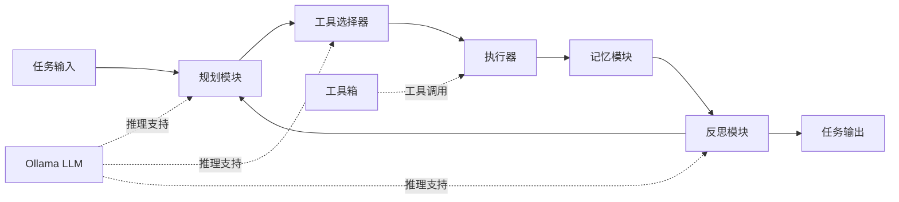

### 4.2 专业智能体定义

#### 4.2.1 邮件智能体 (EmailAgent)

**职责范围**:
- 邮件自动分类和优先级标注
- 智能回复建议生成
- 批量邮件处理和归档
- 邮件摘要提取

**工具集**:
| 工具名称 | 功能描述 | 输入参数 | 输出结果 |
|---------|---------|---------|---------|
| read_emails | 读取邮箱中的邮件 | 邮箱账号、时间范围、过滤条件 | 邮件列表 |
| classify_email | 邮件分类 | 邮件内容 | 分类标签 |
| draft_reply | 生成回复草稿 | 原邮件内容、回复意图 | 回复邮件草稿 |
| send_email | 发送邮件 | 收件人、主题、正文、附件 | 发送状态 |
| archive_emails | 归档邮件 | 邮件ID列表、归档规则 | 归档结果 |

**决策流程**:
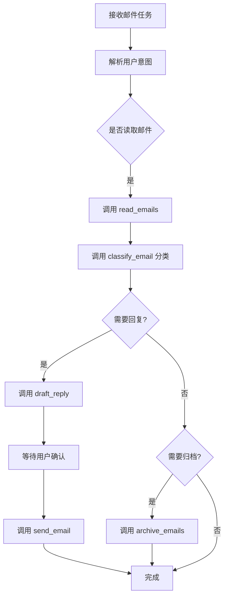

#### 4.2.2 文档智能体 (DocAgent)

**职责范围**:
- 文档格式转换 (Word/PDF/Markdown 等)
- 文档内容摘要和关键信息提取
- 文档模板生成和填充
- 多文档内容对比和合并

**工具集**:
| 工具名称 | 功能描述 | 输入参数 | 输出结果 |
|---------|---------|---------|---------|
| load_document | 加载文档内容 | 文件路径、文件类型 | 文档内容对象 |
| convert_format | 文档格式转换 | 源文档、目标格式 | 转换后的文档 |
| extract_summary | 提取文档摘要 | 文档内容、摘要长度 | 摘要文本 |
| extract_entities | 提取关键实体 | 文档内容、实体类型 | 实体列表 |
| fill_template | 填充文档模板 | 模板路径、数据字典 | 生成的文档 |
| compare_documents | 文档对比 | 文档A、文档B | 差异报告 |

#### 4.2.3 日程智能体 (ScheduleAgent)

**职责范围**:
- 会议安排和冲突检测
- 日程提醒和优先级调整
- 时间规划建议
- 会议纪要生成

**工具集**:
| 工具名称 | 功能描述 | 输入参数 | 输出结果 |
|---------|---------|---------|---------|
| get_schedule | 获取日程安排 | 时间范围 | 日程列表 |
| check_conflict | 检查时间冲突 | 新日程、现有日程列表 | 冲突报告 |
| create_event | 创建日程事件 | 事件详情 (时间、地点、参与者) | 事件ID |
| update_event | 更新日程事件 | 事件ID、更新内容 | 更新状态 |
| suggest_time | 智能时间建议 | 参与者列表、时长、约束条件 | 推荐时间段列表 |
| generate_minutes | 生成会议纪要 | 会议录音/文本、会议信息 | 会议纪要 |

#### 4.2.4 数据分析智能体 (DataAgent)

**职责范围**:
- Excel/CSV 数据处理和分析
- 数据可视化图表生成
- 统计分析和趋势预测
- 报表自动生成

**工具集**:
| 工具名称 | 功能描述 | 输入参数 | 输出结果 |
|---------|---------|---------|---------|
| load_data | 加载数据文件 | 文件路径、数据格式 | 数据框对象 |
| analyze_data | 数据统计分析 | 数据框、分析类型 | 分析结果 |
| filter_data | 数据筛选 | 数据框、筛选条件 | 筛选后的数据 |
| aggregate_data | 数据聚合 | 数据框、聚合规则 | 聚合结果 |
| visualize_data | 生成图表 | 数据框、图表类型 | 图表文件 |
| generate_report | 生成数据报表 | 分析结果、模板 | 报表文档 |

#### 4.2.5 知识问答智能体 (KnowledgeAgent)

**职责范围**:
- 基于本地知识库的问答
- 文档检索和语义搜索
- 知识图谱构建和查询
- 学习新知识并更新知识库

**工具集**:
| 工具名称 | 功能描述 | 输入参数 | 输出结果 |
|---------|---------|---------|---------|
| semantic_search | 语义搜索 | 查询文本、Top-K | 相关文档片段列表 |
| qa_with_context | 基于上下文问答 | 问题、上下文文档 | 答案 |
| index_document | 索引新文档 | 文档内容、元数据 | 索引状态 |
| update_knowledge | 更新知识库 | 新知识条目 | 更新状态 |
| query_graph | 知识图谱查询 | 查询语句 | 查询结果 |

#### 4.2.6 文件系统管理智能体 (FileAgent)

**职责范围**:
- 智能文件分类和整理
- 重复文件检测和清理
- 文件批量重命名和移动
- 文件夹结构优化建议
- 文件搜索和定位
- 磁盘空间分析和清理

**工具集**:
| 工具名称 | 功能描述 | 输入参数 | 输出结果 |
|---------|---------|---------|---------||
| scan_directory | 扫描目录结构 | 目录路径、递归深度、文件类型过滤 | 文件树结构 |
| classify_files | 文件智能分类 | 文件列表、分类规则 | 分类方案 |
| detect_duplicates | 检测重复文件 | 目录路径、检测算法 (hash/name/size) | 重复文件组列表 |
| batch_rename | 批量重命名文件 | 文件列表、命名规则 | 重命名结果 |
| batch_move | 批量移动文件 | 文件列表、目标路径映射 | 移动结果 |
| organize_files | 自动整理文件 | 源目录、整理策略 (按类型/日期/项目) | 整理后的目录结构 |
| search_files | 文件搜索 | 搜索关键词、路径范围、文件类型 | 匹配文件列表 |
| analyze_storage | 磁盘空间分析 | 目录路径 | 空间占用报告 |
| clean_temp_files | 清理临时文件 | 目录路径、清理规则 | 清理结果 |
| compress_files | 文件压缩 | 文件列表、压缩格式 | 压缩包路径 |
| extract_archive | 解压缩文件 | 压缩包路径、目标目录 | 解压结果 |

**决策流程**:
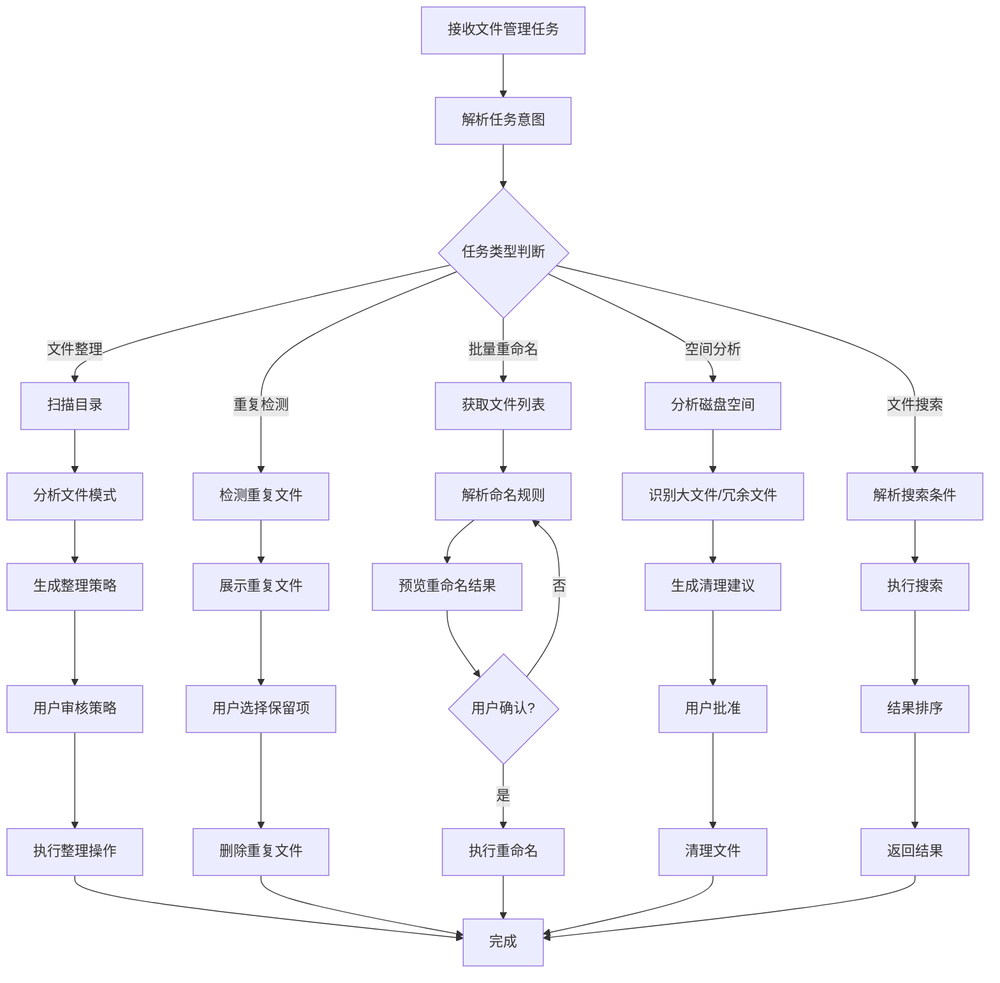

**智能整理策略**:

| 整理维度 | 分类依据 | 应用场景 |
|---------|---------|----------|
| 按文件类型 | 文件扩展名 | 下载文件夹整理 |
| 按创建时间 | 文件创建日期 (年/月) | 照片、日志归档 |
| 按项目 | 文件名关键词、路径模式 | 工作文档整理 |
| 按大小 | 文件大小分级 | 磁盘空间优化 |
| 按访问频率 | 最后访问时间 | 冷热数据分离 |

**文件分类规则示例**:

| 文件类型 | 扩展名 | 目标文件夹 |
|---------|-------|----------|
| 文档 | .docx, .pdf, .txt, .md | Documents/ |
| 图片 | .jpg, .png, .gif, .svg | Images/ |
| 视频 | .mp4, .avi, .mkv | Videos/ |
| 音频 | .mp3, .wav, .flac | Music/ |
| 压缩包 | .zip, .rar, .7z | Archives/ |
| 表格 | .xlsx, .csv | Spreadsheets/ |
| 演示文稿 | .pptx, .key | Presentations/ |
| 代码 | .py, .js, .java, .cpp | Code/ |
| 安装包 | .exe, .dmg, .apk | Installers/ |

**重复文件检测策略**:

| 检测方法 | 准确度 | 性能 | 适用场景 |
|---------|-------|------|----------|
| 文件名比对 | 低 | 快 | 快速粗筛 |
| 文件大小比对 | 中 | 快 | 初步过滤 |
| MD5哈希 | 高 | 中 | 精确去重 |
| 内容相似度 | 中 | 慢 | 近似重复检测 |
| 组合策略 | 高 | 中 | 推荐使用 (先大小后哈希) |

## 5. Ollama 模型集成架构

### 5.1 模型服务抽象层

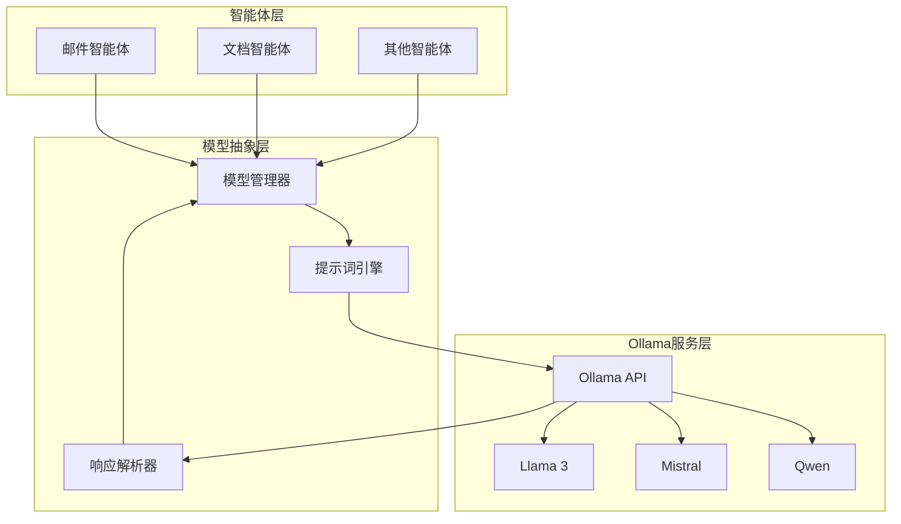

### 5.2 模型配置策略

| 任务类型 | 推荐模型 | 模型参数 | 选择理由 |
|---------|---------|---------|---------|
| 任务理解与规划 | Llama 3 8B | temperature=0.3, top_p=0.9 | 推理能力强,适合复杂任务分解 |
| 文档摘要生成 | Qwen 7B | temperature=0.5, max_tokens=500 | 中文理解优秀,摘要质量高 |
| 邮件回复生成 | Mistral 7B | temperature=0.7, top_p=0.95 | 生成流畅,语气自然 |
| 数据分析推理 | Llama 3 8B | temperature=0.1, top_p=0.8 | 逻辑严谨,适合数值推理 |
| 知识问答 | Qwen 7B | temperature=0.2, top_p=0.85 | 事实性强,幻觉少 |
| 文件整理规划 | Llama 3 8B | temperature=0.3, top_p=0.9 | 结构化思维强,适合规划任务 |

### 5.3 提示词工程策略

#### 任务理解提示词模板
```
角色定义: 你是一个专业的任务分析专家
任务目标: 分析用户的办公需求并提取关键信息
输入格式: 用户的自然语言指令
输出格式: JSON 结构,包含任务类型、实体、约束条件
思维链: 按照"理解意图 -> 识别实体 -> 确定优先级"的步骤分析
```

#### 工具调用提示词模板
```
角色定义: 你是一个能够使用工具的智能助手
可用工具: [工具列表及描述]
任务目标: 根据当前任务选择合适的工具并生成调用参数
输出格式: JSON 格式的工具调用请求
约束条件: 每次只调用一个工具,参数必须完整
```

#### 反思优化提示词模板
```
角色定义: 你是一个善于自我反思的智能体
任务历史: [之前的执行记录]
执行结果: [当前执行结果]
分析目标: 评估结果质量,识别问题,提出改进建议
输出格式: 包含问题诊断和优化方案的结构化报告
```

## 6. 数据流与记忆机制

### 6.1 数据流设计

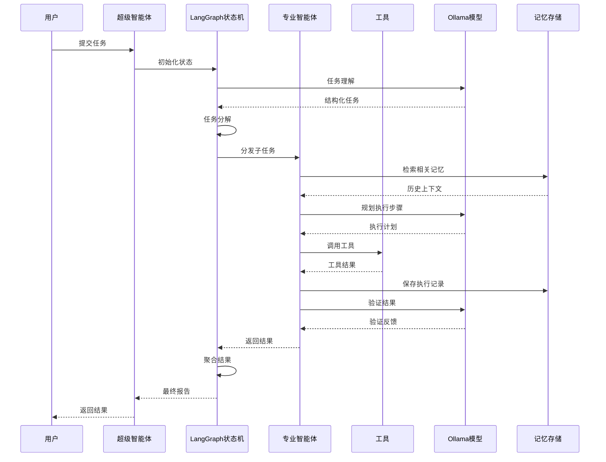

### 6.2 记忆系统架构

#### 短期记忆 (对话上下文)
- **存储内容**: 当前会话的用户输入、智能体响应、中间执行状态
- **存储时长**: 会话结束后清除
- **实现方式**: 基于 LangChain 的 ConversationBufferMemory
- **检索策略**: 按时间顺序检索最近 N 条记录

#### 长期记忆 (知识库)
- **存储内容**: 文档向量、实体关系、执行成功的任务模板
- **存储时长**: 持久化存储
- **实现方式**: 基于 ChromaDB 的向量存储 + 元数据索引
- **检索策略**: 语义相似度检索 + 元数据过滤

#### 工作记忆 (任务执行状态)
- **存储内容**: LangGraph 状态图的当前状态、子任务执行进度
- **存储时长**: 任务完成后归档
- **实现方式**: LangGraph 内置的 State 管理
- **检索策略**: 基于任务 ID 的快速查询

### 6.3 记忆检索策略

| 检索场景 | 检索方法 | 相似度阈值 | Top-K |
|---------|---------|-----------|-------|
| 知识问答 | 向量语义检索 | 0.75 | 5 |
| 任务规划 | 元数据过滤 + 语义检索 | 0.70 | 3 |
| 邮件分类 | 历史分类记录检索 | 0.80 | 10 |
| 文档模板匹配 | 模板库检索 | 0.85 | 3 |
| 文件分类策略 | 历史整理策略检索 | 0.75 | 5 |

## 7. 核心功能场景设计

### 7.1 场景一:智能邮件处理

**用户输入示例**: "帮我处理今天的邮件,重要邮件优先回复,垃圾邮件归档"

**执行流程**:
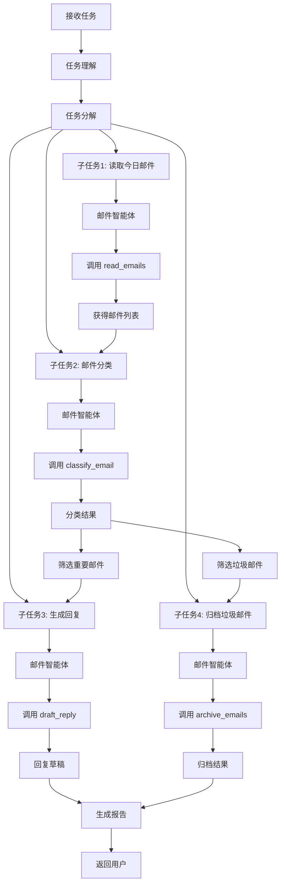

**预期输出**:
- 重要邮件列表及回复草稿
- 已归档的垃圾邮件数量
- 待处理邮件的优先级建议

### 7.2 场景二:文档智能摘要与对比

**用户输入示例**: "对比这两份合同的差异,并生成摘要报告"

**执行流程**:
1. 文档智能体加载两份合同文档
2. 分别提取每份合同的关键条款和实体
3. 使用 Ollama 模型进行语义对比
4. 识别差异点 (新增、删除、修改)
5. 生成结构化的差异报告
6. 生成整体摘要,突出核心差异

**输出结构**:
| 对比维度 | 合同A | 合同B | 差异说明 |
|---------|------|------|---------|
| 合同金额 | 100万元 | 120万元 | 增加20万元 |
| 履约期限 | 12个月 | 18个月 | 延长6个月 |
| 违约条款 | 存在 | 修改 | 违约金比例从10%降至5% |

### 7.3 场景三:智能日程协调

**用户输入示例**: "安排下周与张经理、李总监的项目讨论会,时长2小时"

**执行流程**:
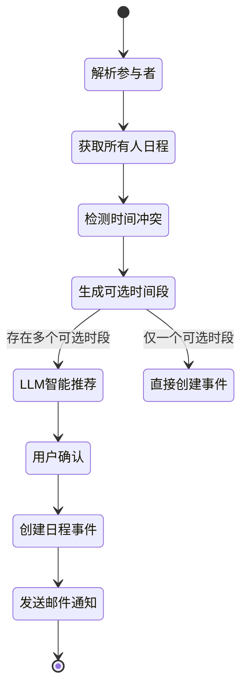

**智能推荐依据**:
- 避开午休时间和临近下班时间
- 优先选择所有人都有较长空闲时段的时间
- 考虑会议室可用性 (如果集成)
- 参考历史会议习惯 (如团队通常上午开会)

### 7.4 场景四:数据分析与报表生成

**用户输入示例**: "分析本月销售数据,生成可视化报告"

**执行流程**:
1. 数据智能体加载销售数据文件
2. 数据清洗和预处理
3. 多维度统计分析 (按地区、产品、时间等)
4. 趋势分析和异常检测
5. 生成图表 (柱状图、折线图、饼图)
6. 使用 Ollama 模型生成数据洞察和建议
7. 填充报表模板生成最终报告

**分析维度**:
- 总销售额及同比/环比增长率
- 各地区销售额排名
- Top 10 畅销产品
- 销售趋势预测
- 异常销售点分析

### 7.5 场景五:知识库问答

**用户输入示例**: "公司的差旅报销流程是什么?"

**执行流程**:
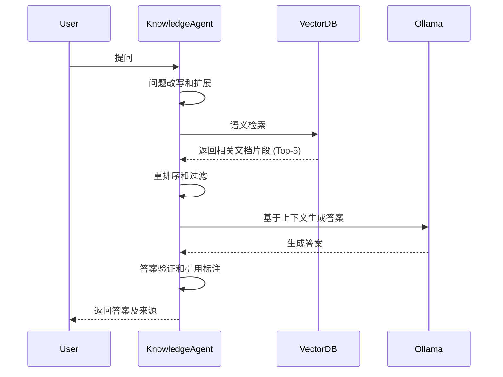

**答案质量保障**:
- 引用原文档的具体段落
- 标注信息来源和可信度
- 当信息不足时明确告知用户
- 提供相关问题建议

### 7.6 场景六:智能文件整理

**用户输入示例**: "整理我的下载文件夹,按类型分类,删除重复文件"

**执行流程**:
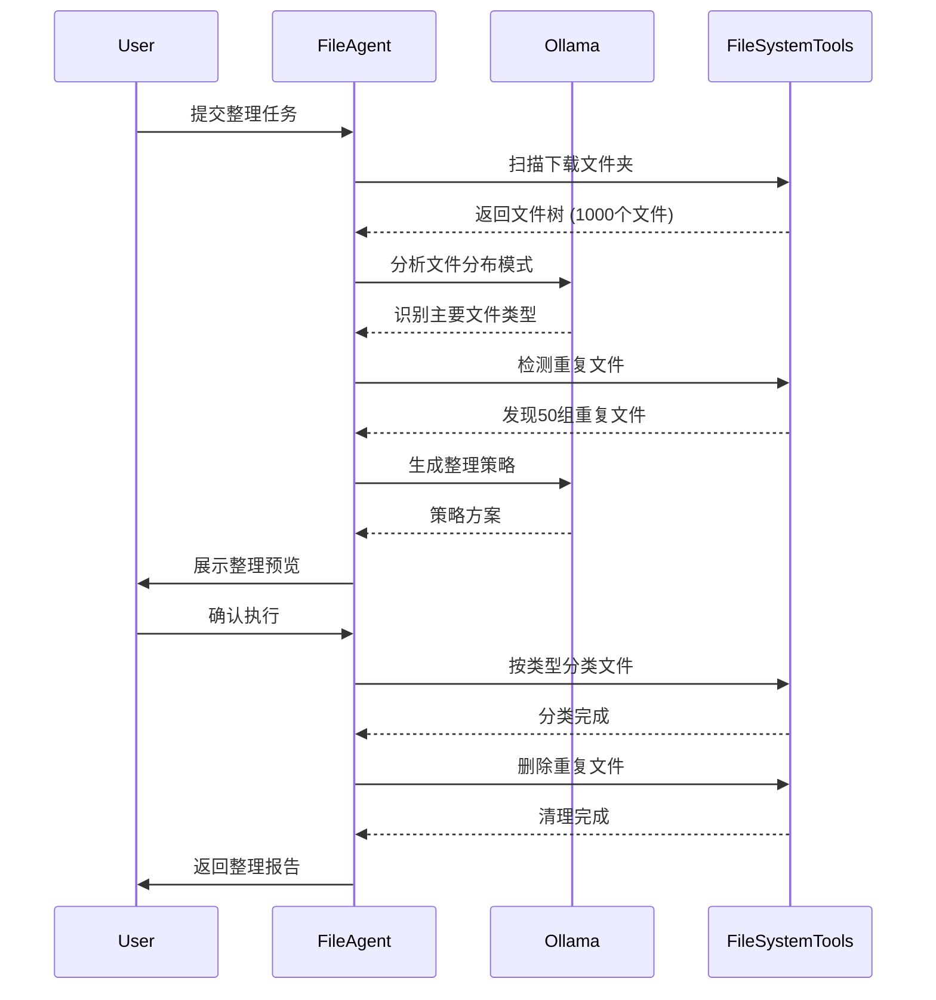

**整理策略示例**:
```
整理计划:
1. 文件分类 (共1000个文件):
   - 文档类 (350个) → Documents/
   - 图片类 (200个) → Images/
   - 视频类 (150个) → Videos/
   - 压缩包 (100个) → Archives/
   - 其他 (200个) → Others/

2. 重复文件处理 (共50组,节省空间1.2GB):
   - 保留最新版本
   - 删除旧版本或副本

3. 临时文件清理:
   - 删除 .tmp, .cache 文件 (节省300MB)

预计释放空间: 1.5GB
```

**执行结果报告**:
| 操作类型 | 文件数量 | 释放空间 | 耗时 |
|---------|---------|---------|------|
| 文件分类 | 1000 | - | 15秒 |
| 重复清理 | 50 | 1.2GB | 8秒 |
| 临时清理 | 80 | 300MB | 3秒 |
| **总计** | **1130** | **1.5GB** | **26秒** |

## 8. 系统配置设计

### 8.1 环境配置参数

| 配置项 | 说明 | 默认值 | 是否必填 |
|-------|------|--------|---------|
| OLLAMA_BASE_URL | Ollama 服务地址 | http://localhost:11434 | 是 |
| DEFAULT_MODEL | 默认使用的模型名称 | llama3:8b | 是 |
| VECTOR_DB_TYPE | 向量数据库类型 | chromadb | 是 |
| VECTOR_DB_PATH | 向量数据库存储路径 | ./data/vectordb | 是 |
| MEMORY_STORE_PATH | 记忆存储路径 | ./data/memory | 是 |
| MAX_RETRY_TIMES | 任务执行最大重试次数 | 3 | 否 |
| TASK_TIMEOUT | 单任务超时时间 (秒) | 300 | 否 |
| LOG_LEVEL | 日志级别 | INFO | 否 |
| ENABLE_CACHE | 是否启用缓存 | true | 否 |

### 8.2 智能体配置

每个专业智能体可独立配置以下参数:

| 配置项 | 说明 | 示例值 |
|-------|------|--------|
| agent_name | 智能体名称 | email_agent |
| model_name | 使用的模型 | llama3:8b |
| temperature | 生成温度 | 0.3 |
| max_iterations | 最大迭代次数 | 10 |
| tools | 可用工具列表 | ["read_emails", "send_email"] |
| memory_enabled | 是否启用记忆 | true |
| reflection_enabled | 是否启用反思 | true |

### 8.3 工具配置

#### 邮件工具配置
| 配置项 | 说明 | 示例值 |
|-------|------|--------|
| email_protocol | 邮件协议 | IMAP/SMTP |
| email_server | 邮件服务器地址 | imap.example.com |
| email_account | 邮箱账号 | user@example.com |
| email_password | 邮箱密码或授权码 | [加密存储] |

#### 日程工具配置
| 配置项 | 说明 | 示例值 |
|-------|------|--------|
| calendar_type | 日历类型 | local/google/outlook |
| calendar_file | 本地日历文件路径 | ./data/calendar.ics |
| sync_interval | 同步间隔 (分钟) | 15 |

#### 文件系统工具配置
| 配置项 | 说明 | 示例值 |
|-------|------|--------|
| watch_directories | 监控的目录列表 | ["~/Downloads", "~/Documents"] |
| auto_organize_enabled | 是否启用自动整理 | false |
| backup_before_delete | 删除前是否备份 | true |
| backup_directory | 备份目录 | ./data/backups |
| duplicate_check_method | 重复检测方法 | hash (可选: hash/name/size) |
| file_classification_rules | 文件分类规则配置文件 | ./config/file_rules.json |
| temp_file_patterns | 临时文件匹配模式 | ["*.tmp", "*.cache", "~$*"] |
| safe_delete_confirm | 删除确认阈值 (文件数) | 10 |

## 9. 测试策略

### 9.1 单元测试范围

| 测试对象 | 测试重点 | 测试方法 |
|---------|---------|---------|
| 工具函数 | 输入输出正确性、边界条件处理 | 单元测试,使用 Mock 数据 |
| 提示词模板 | 模板渲染正确性、参数注入安全性 | 模板测试,使用固定数据集 |
| 状态转移逻辑 | LangGraph 状态转移条件准确性 | 状态机测试,覆盖所有路径 |
| 记忆检索 | 检索准确率、召回率 | 使用标准数据集评估 |

### 9.2 集成测试场景

| 测试场景 | 测试目标 | 验证指标 |
|---------|---------|---------|
| 端到端邮件处理 | 验证从接收任务到发送邮件的完整流程 | 任务成功率 > 95% |
| 多智能体协作 | 验证任务分解和结果聚合的准确性 | 子任务分配正确率 > 90% |
| 模型切换 | 验证不同模型的兼容性 | 所有模型均能正常调用 |
| 异常恢复 | 验证工具调用失败后的重试和降级机制 | 自动恢复成功率 > 80% |
| 文件整理操作 | 验证文件扫描、分类、移动的完整流程 | 文件分类准确率 > 90% |
| 重复文件检测 | 验证重复文件识别的准确性 | 检测准确率 > 95%, 误报率 < 5% |

### 9.3 性能测试指标

| 性能指标 | 目标值 | 测试方法 |
|---------|-------|---------|
| 任务理解响应时间 | < 3秒 | 使用 100 条测试指令进行压测 |
| 单智能体执行时间 | < 30秒 | 测试各类典型任务 |
| 向量检索时间 | < 1秒 | 在 10000 条文档库中检索 |
| 并发任务处理能力 | 支持 10 个并发任务 | 模拟多用户同时提交任务 |
| 文件扫描速度 | > 1000个文件/秒 | 测试大型目录扫描 |
| 重复文件检测速度 | < 5秒/1000个文件 | 使用哈希算法测试 |

### 9.4 模型质量评估

| 评估维度 | 评估方法 | 合格标准 |
|---------|---------|---------|
| 任务理解准确率 | 人工标注 100 条指令的意图识别结果 | 准确率 > 85% |
| 工具调用正确率 | 统计工具选择和参数生成的正确性 | 正确率 > 80% |
| 回复质量 | 人工评分 (相关性、流畅性、准确性) | 平均分 > 4/5 |
| 摘要质量 | ROUGE 分数评估 | ROUGE-L > 0.4 |

## 10. 扩展性设计

### 10.1 插件化架构

系统支持通过插件方式扩展新的智能体和工具:

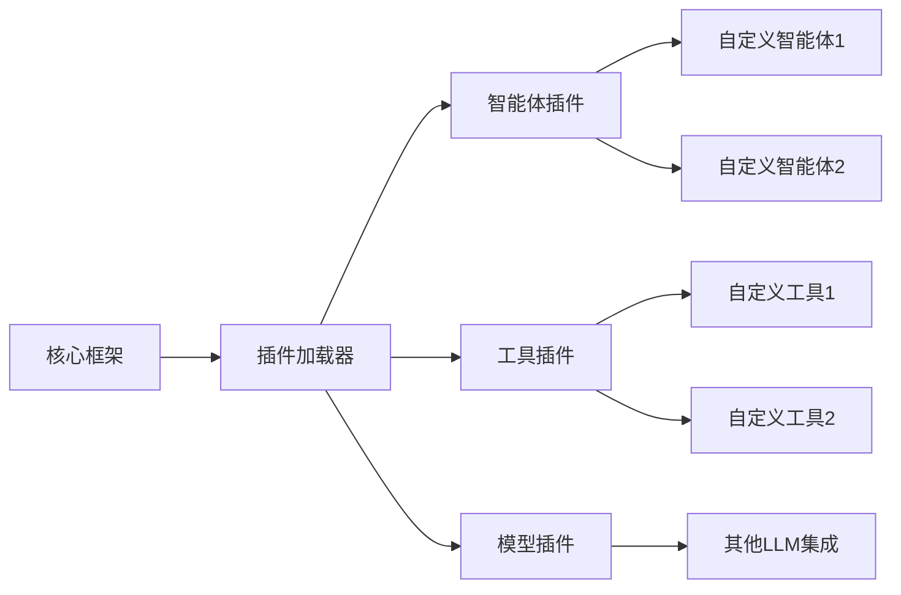

**插件规范**:
- 每个插件需提供元数据配置 (名称、版本、依赖)
- 智能体插件需实现标准的 Agent 接口
- 工具插件需实现标准的 Tool 接口,包含工具描述、参数模式、执行函数
- 插件需通过配置文件注册到系统

### 10.2 多模态扩展能力

系统架构预留了多模态输入输出的扩展接口:

| 模态类型 | 输入能力 | 输出能力 | 实现方式 |
|---------|---------|---------|---------|
| 文本 | 自然语言指令 | 结构化报告、邮件草稿 | 已实现 |
| 语音 | 语音指令 (待扩展) | 语音播报 (待扩展) | 集成 Whisper + TTS |
| 图像 | 文档扫描、图表识别 (待扩展) | 可视化图表 | 集成 OCR + 图表生成库 |
| 视频 | 会议录像分析 (待扩展) | 会议摘要视频 | 集成视频处理工具 |

### 10.3 外部系统集成

系统提供标准的集成接口,支持与第三方办公系统对接:

| 集成对象 | 集成方式 | 数据流向 |
|---------|---------|---------|
| 企业邮箱 (Exchange/Gmail) | IMAP/SMTP 协议 | 双向 |
| 日历系统 (Google Calendar/Outlook) | CalDAV 协议或 API | 双向 |
| 文件存储 (OneDrive/Google Drive) | OAuth + REST API | 双向 |
| 即时通讯 (钉钉/企业微信) | Webhook + Bot API | 接收消息,发送通知 |
| 数据库 (MySQL/PostgreSQL) | 数据库连接器 | 读取数据 |

## 11. 安全与隐私

### 11.1 数据安全策略

| 安全措施 | 实现方式 | 保护对象 |
|---------|---------|---------|
| 本地化部署 | 所有服务在本地运行,数据不出本地网络 | 所有用户数据 |
| 敏感信息加密 | 使用 AES-256 加密存储密码和 Token | 邮箱密码、API密钥 |
| 访问控制 | 基于角色的权限管理 | 系统配置、敏感操作 |
| 审计日志 | 记录所有敏感操作的执行记录 | 邮件发送、文件访问、文件删除 |

### 11.2 隐私保护机制

- **数据最小化原则**: 仅收集和处理完成任务所必需的数据
- **数据匿名化**: 在日志和分析中脱敏处理个人身份信息
- **用户控制**: 用户可随时查看、修改、删除个人数据和历史记录
- **模型隔离**: 每个用户的模型微调和记忆相互隔离

### 11.3 模型安全

| 风险类型 | 防护措施 |
|---------|---------|
| 提示词注入攻击 | 对用户输入进行清洗和验证,限制特殊字符 |
| 模型幻觉 | 启用反思机制,对关键事实进行验证 |
| 恶意工具调用 | 工具调用前进行权限检查和参数验证 |
| 敏感信息泄露 | 在输出前过滤敏感信息 (邮箱、电话、密码等) |
| 文件操作安全 | 文件删除前需用户确认,重要文件自动备份 |

## 12. 部署架构

### 12.1 本地部署架构

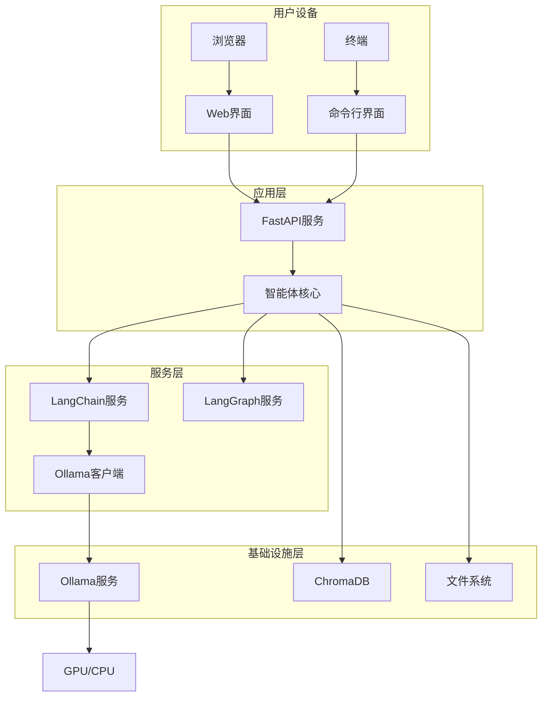

### 12.2 部署环境要求

| 资源类型 | 最低配置 | 推荐配置 |
|---------|---------|---------|
| CPU | 4核 | 8核以上 |
| 内存 | 16GB | 32GB 以上 |
| GPU | 无 (可选) | NVIDIA RTX 3060 或以上 |
| 存储 | 50GB | 100GB SSD |
| 操作系统 | Windows 10/11, macOS 12+, Ubuntu 20.04+ | 任意支持 Docker 的系统 |
| Python 版本 | 3.10+ | 3.11+ |

### 12.3 服务依赖

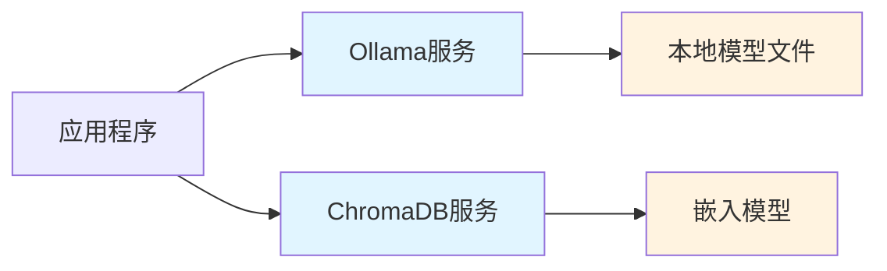

**服务启动顺序**:
1. 启动 Ollama 服务并加载模型
2. 初始化 ChromaDB 并加载嵌入模型
3. 启动应用程序主服务
4. 启动 Web UI (可选)

### 12.4 容器化部署方案

系统支持通过容器化方式快速部署:

**服务组件**:
- **ollama 容器**: 运行 Ollama 模型服务
- **app 容器**: 运行智能体应用程序
- **chromadb 容器**: 运行向量数据库服务
- **web 容器**: 运行 Web 界面 (可选)

**容器编排**:
- 使用 Docker Compose 进行多容器编排
- 数据卷挂载确保数据持久化
- 容器间通过内部网络通信

## 13. 监控与运维

### 13.1 系统监控指标

| 监控维度 | 关键指标 | 告警阈值 |
|---------|---------|---------|
| 服务可用性 | Ollama 服务响应时间 | > 5秒 |
| 资源使用 | CPU 使用率 | > 80% |
| 资源使用 | 内存使用率 | > 90% |
| 任务执行 | 任务失败率 | > 10% |
| 任务执行 | 平均任务耗时 | > 60秒 |
| 模型性能 | Token 生成速度 | < 10 tokens/s |

### 13.2 日志管理

**日志级别**:
- DEBUG: 详细的调试信息,包括 LLM 输入输出
- INFO: 常规操作信息,如任务开始/结束
- WARNING: 警告信息,如重试操作
- ERROR: 错误信息,如工具调用失败
- CRITICAL: 严重错误,如服务崩溃

**日志内容**:
- 时间戳、日志级别、模块名称
- 任务 ID、用户 ID (脱敏)
- 操作描述、执行结果
- 异常堆栈 (如有)

### 13.3 故障恢复机制

| 故障类型 | 检测方式 | 恢复策略 |
|---------|---------|---------|
| Ollama 服务不可用 | 心跳检测 | 自动重启服务,使用备用模型 |
| 工具调用失败 | 异常捕获 | 重试机制 (最多3次),降级处理 |
| 任务执行超时 | 超时计时器 | 终止任务,返回部分结果 |
| 内存溢出 | 资源监控 | 清理缓存,重启服务 |
| 向量数据库损坏 | 健康检查 | 从备份恢复,重建索引 |
| 文件操作失败 | 异常捕获 | 从备份恢复,回滚操作,通知用户 |

### 13.4 性能优化建议

| 优化方向 | 具体措施 | 预期收益 |
|---------|---------|---------|
| 模型推理加速 | 使用量化模型 (如 Q4_K_M) | 推理速度提升 2-3 倍 |
| 缓存机制 | 缓存相似查询的 LLM 响应 | 重复查询响应时间减少 90% |
| 并行处理 | 独立子任务并行执行 | 整体任务时间减少 30-50% |
| 向量检索优化 | 使用 HNSW 索引 | 检索时间减少 80% |
| 批处理 | 批量处理相似类型任务 | 吞吐量提升 2 倍 |
| 文件扫描优化 | 使用多线程扫描,过滤隐藏文件 | 扫描速度提升20-30% |
| 文件哈希计算 | 使用增量哈希,缓存已计算结果 | 重复检测时间减少50% |
